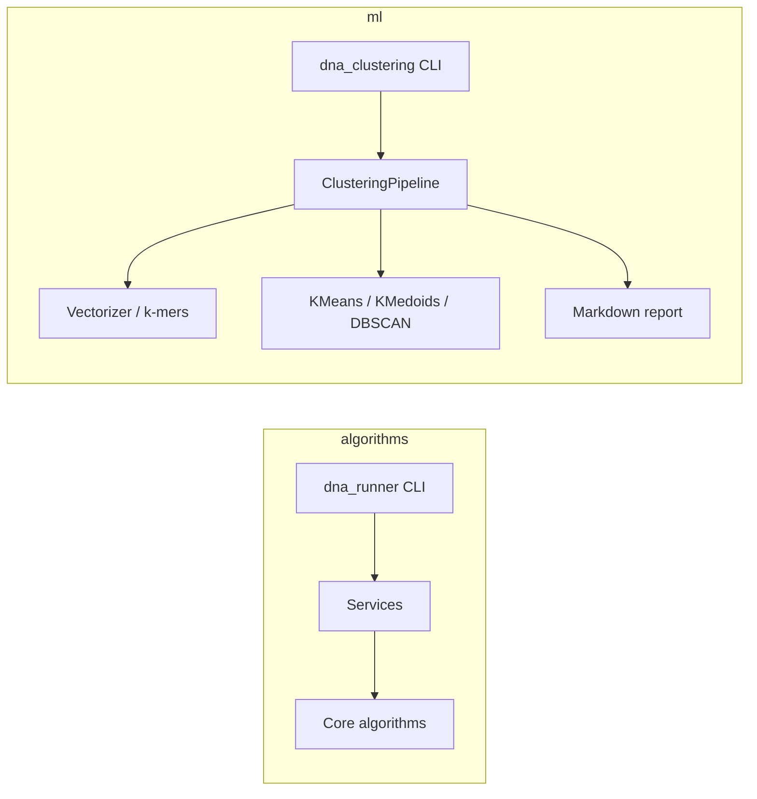

# DNA Analyzer

Проект на C++20 для анализа ДНК-последовательностей. Состоит из двух независимых модулей:

- **algorithms** — CLI-утилиты с классическими алгоритмами на строках (поиск, выравнивание, регулярные выражения и др.).
- **ml** — конвейер кластеризации ДНК-записей по k-mer признакам с отчётом в Markdown.

Сборка выполняется через Make. Исходный код расположен в каталоге `src/`.

## Требования

- **Компилятор:** `g++` с поддержкой C++20
- **Тесты:** [Google Test](https://github.com/google/googletest)
  - macOS: `brew install googletest`
  - Linux: пакет `libgtest-dev` (или аналог в вашем дистрибутиве)
- **Покрытие (опционально):** `gcovr`
- **Проверка лимитов на macOS (опционально):** GNU `time` — `brew install gnu-time`

## Сборка

Все команды выполняются из каталога `src/`:

```bash
cd src
make all      # библиотеки, приложения и тесты
make app      # только исполняемые файлы
make tests    # сборка и запуск тестов
make clean    # очистка артефактов сборки
```

Результаты сборки:

| Модуль      | Исполняемый файл              | Статическая библиотека        |
|-------------|-------------------------------|-------------------------------|
| algorithms  | `build/dna/dna_runner`        | `build/dna/DNA_Analyzer.a`    |
| ml          | `build/ml/dna_clustering`     | `build/ml/ML_Analyzer.a`      |

## Модуль algorithms (`dna_runner`)

Точка входа: `src/algorithms/main.cpp`. Команды передаются первым аргументом.

### Команды

| Команда         | Аргументы | Описание |
|-----------------|-----------|----------|
| `exact-search`  | `<textFilePath> <patternFilePath>` | Точный поиск подстроки (Rabin–Karp). Позиции в выводе — **с 1** |
| `align-score`   | `<inputFilePath>` | Оценка глобального выравнивания (Needleman–Wunsch) |
| `align`         | `<inputFilePath>` | Полное выравнивание с визуализацией |
| `regex-match`   | `<inputFilePath>` | Проверка соответствия последовательности регулярному шаблону |
| `k-similarity`  | `<inputFilePath>` | Минимальное число обменов соседних символов для превращения одной строки в другую (анаграммы) |
| `min-window`    | `<inputFilePath>` | Минимальное окно в тексте, содержащее все символы образца (с учётом кратности) |

### Форматы входных файлов

**Выравнивание** (`align`, `align-score`) — три строки:

```
<match> <mismatch> <gap>
<последовательность 1>
<последовательность 2>
```

**Точный поиск** (`exact-search`) — два аргумента: путь к файлу с текстом и путь к файлу с образцом. В каждом файле ровно одна строка ДНК (символы `A`, `C`, `G`, `T`); длина текста — до 10 000 символов, образца — до 100.

**Регулярное выражение** — две строки: последовательность и шаблон. В шаблоне допустимы литералы `A–Z`, а также:

- `.` — один любой символ
- `?` — ноль или один предыдущий элемент
- `+` — один или более предыдущего элемента
- `*` — ноль или более любых символов

**K-similarity** и **min-window** — по две строки (две последовательности или текст и образец).

### Примеры

```bash
./build/dna/dna_runner exact-search exact_text.txt exact_pattern.txt
./build/dna/dna_runner align-score align_score_input.txt
./build/dna/dna_runner regex-match regex_true.txt
```

Готовые тестовые файлы и демонстрационный прогон:

```bash
cd src
make run-examples    # создаёт test_data и прогоняет все команды
```

Проверка ограничений по времени (≤ 1 с) и памяти (≤ 128 МБ) на больших данных:

```bash
cd src
make check-limits    # требует GNU time и скрипт create_large_test_files
```

## Модуль ml (`dna_clustering`)

Кластеризует набор ДНК-записей из CSV, перебирает длины k-mer от `--min-k` до `--max-k` и сравнивает алгоритмы по метрике **Rand Index** относительно размеченных классов. Результат — Markdown-отчёт.

### Алгоритмы кластеризации

- K-Means
- K-Medoids
- DBSCAN (параметр `eps` задаётся через `FixedTableEpsProvider`)

### Запуск

```bash
./build/ml/dna_clustering \
  --input datasets/datasetCompact.csv \
  --output report.md
```

### Параметры

| Параметр | По умолчанию | Описание |
|----------|--------------|----------|
| `--input` | — | Путь к CSV (обязательный) |
| `--output` | — | Путь к отчёту `.md` (обязательный) |
| `--min-k` | 1 | Минимальная длина k-mer |
| `--max-k` | 6 | Максимальная длина k-mer |
| `--seed` | 42 | Seed для случайных алгоритмов |
| `--kmeans-iters` | 100 | Макс. итераций K-Means |
| `--kmedoids-iters` | 100 | Макс. итераций K-Medoids |
| `--dbscan-min-points` | 3 | Минимум точек в кластере DBSCAN |
| `--help` | — | Справка |

### Формат CSV

Первая строка — заголовок (пропускается). Далее строки вида:

```csv
sequence,classId,species
ATGC...,1,human
```

- **sequence** — ДНК-строка (`A`, `C`, `G`, `T`, допускается `N`)
- **classId** — целочисленная метка класса (эталон для Rand Index)
- **species** — название вида (информационное поле)

Примеры наборов данных лежат в каталоге `datasets/` (`datasetCompact.csv`, `training.csv`, `test.csv`).

## Структура проекта

```
dna/
├── datasets/          # CSV-наборы для кластеризации
├── src/
│   ├── algorithms/    # модуль dna_runner: алгоритмы, CLI, тесты
│   └── ml/            # модуль dna_clustering: кластеризация, отчёты, тесты
└── build/             # артефакты сборки (создаётся make, в .gitignore)
```

**`src/algorithms/`**

| Папка     | Назначение |
|-----------|------------|
| `core/`   | Реализации алгоритмов (Rabin–Karp, Needleman–Wunsch, regex и др.) |
| `app/`    | Сервисный слой: связывает команды CLI с алгоритмами |
| `cli/`    | Разбор аргументов и диспетчеризация команд |
| `io/`     | Чтение входных файлов и форматирование вывода |
| `scripts/`| Генерация тестовых данных и проверка лимитов производительности |
| `tests/`  | Unit-тесты (Google Test) |

**`src/ml/`**

| Папка            | Назначение |
|------------------|------------|
| `app/`           | Конвейер кластеризации (`ClusteringPipeline`) |
| `cli/`           | Разбор аргументов командной строки |
| `data/`          | Загрузка, парсинг и валидация CSV |
| `preprocessing/` | Извлечение k-mer и векторизация последовательностей |
| `clustering/`    | K-Means, K-Medoids, DBSCAN |
| `metrics/`       | Метрики качества (Rand Index) |
| `report/`        | Формирование Markdown-отчёта |
| `utils/`         | Вспомогательная валидация ДНК-строк |
| `tests/`         | Unit-тесты (Google Test) |

## Тестирование и покрытие

```bash
cd src
make test       # alias для make tests
make coverage   # отчёт gcovr в gcov_report/
```

Тесты algorithms и ml запускаются отдельно из соответствующих подкаталогов (`make -C algorithms tests`, `make -C ml tests`).

## Архитектура

Оба модуля следуют схожей схеме: **ядро алгоритмов** → **сервисы / pipeline** → **CLI**. В algorithms команды обрабатываются через `CommandDispatcher` и обработчики `ICommandHandler`; в ml основная логика сосредоточена в `ClusteringPipeline`.

